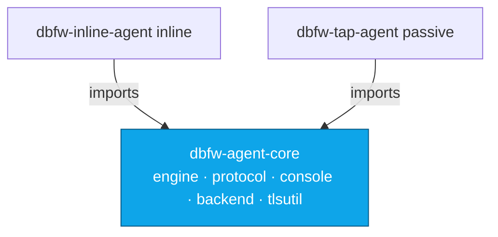

# dbfw-agent-core

The **shared Go library** for the [DB-Firewall](https://github.com/DB-Firewall)
agents. Pure standard library, **no external dependencies**. It holds the code
both the inline proxy and the passive tap need, so the two agents stay
behavior-identical and never drift apart.

---

## Where this fits in the full system

DB-Firewall is a database security layer (DBFW / DAM) that gives every SQL query
its full business context and enables detection, correlation and enforcement.

| Repo | Role in the system |
|------|--------------------|
| [`dbfw-console`](https://github.com/DB-Firewall/dbfw-console) | Central brain + UI: stores events & rules, HTTP-to-SQL correlation (HPTR), dashboards |
| **`dbfw-agent-core`** (this repo) | **Shared library**: wire-protocol parsers, rule engine, console client |
| [`dbfw-inline-agent`](https://github.com/DB-Firewall/dbfw-inline-agent) | **Inline** proxy — imports this library |
| [`dbfw-tap-agent`](https://github.com/DB-Firewall/dbfw-tap-agent) | **Passive** tap — imports this library |
| [`dbfw-nginx-agent`](https://github.com/DB-Firewall/dbfw-nginx-agent) | HTTP collector (self-contained) |
| [`dbfw-host-agent`](https://github.com/DB-Firewall/dbfw-host-agent) | Host-OS monitor (self-contained) |



**Its job in the flow:** it is not deployed on its own — it is the common engine
the query-path agents are built from. A query parsed by the proxy and the same
query parsed by the tap go through *identical* code here, so a rule decision or a
correlation field means the same thing regardless of capture mode.

---

## Packages

- `engine` — deterministic rule engine (allow/alert/block/ignore) + default rule
  sets, and the `EventSink` / `QueryMeta` contract used to emit events.
- `protocol/{postgres,mysql,mongodb}` — wire-protocol packet framing and SQL /
  command extraction, incl. PostgreSQL prepared-statement reconstruction.
- `console` — HTTP client that ships events + heartbeats to `dbfw-console`
  (supports inline `proxy` and monitor-only `tap` modes).
- `backend` — backend DB dialer.
- `tlsutil` — self-signed certificate helpers for TLS termination.

```go
import "github.com/DB-Firewall/dbfw-agent-core/engine"
```

## content package (CDFC)

`content` extracts high-entropy opaque-leaf tokens (uuid, email, jwt, hex digest,
long opaque) from text and fingerprints them with a keyed SHA-256 whose key is
derived from the console secret. It is shared by the DB agents (result-set
tokens) and mirrored byte-for-byte by the gateway Lua (response/request tokens),
so both sides produce identical tokens for the same value. Raw values never leave
the capture point.
